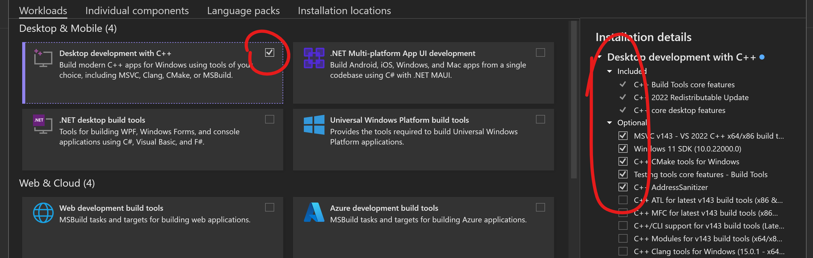

# part_1
Questo chatbot permette di interrogare l'utente sulla conoscenza della cultura Jedi per decidere se quest'ultimo può diventare o meno un Padawan.  
È richiesto ```Python >= 3.10 and < 3.11``` e ```pip``` per l'esecuzione di questo chatbot, con PATH salvata sulle variabili d'ambiente.  
È richiesto inoltre di installare i C++ Build Tools. Il link è il seguente:  

```https://visualstudio.microsoft.com/visual-cpp-build-tools/```

Basterà installare i seguenti pacchetti:  



Per verificare la versione di Python correntemente installata sul proprio terminale, basta aprire un'istanza del prompt 
dei comandi e digitare  

```python --version```

Prima di eseguire lo script ```app.py```, bisogna seguire degli accorgimenti iniziali:

In una qualunque directory del terminale, aprire il terminale e eseguire il seguente comando, utilizzando git, per clonare 
il repository per il chatbot:  

```git clone https://github.com/tln-2023/mazzei-chatbot.git```

creare l'ambiente virtuale:  

```python -m venv venv```

a quel punto, attivarlo:  

```venv\Scripts\activate.bat```

Installare i requirements:  

```pip install -r requirements.txt```

[Opzionale]: se si vuole eliminare il warning di ffmpeg (il quale viene usato nella libreria del TTS), scaricare la build essential dal link seguente e aggiungere il path alla cartella bin alle variabili di sistema (Es: C:\ffmpeg\bin):  

```https://www.gyan.dev/ffmpeg/builds/ffmpeg-git-essentials.7z```

Terminata l'installazione dei vari requirements, si potrà inizializzare il chatbot:

```python app.py``` su Windows/Mac
```python3 app.py``` su Linux